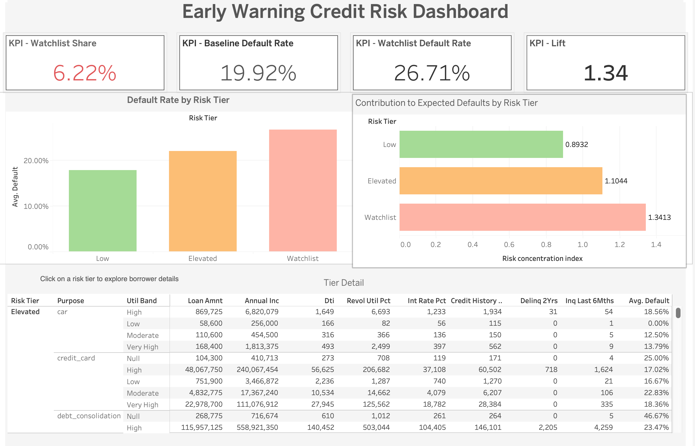

# Early Warning Credit Risk Dashboard

## Project Overview
This project analyzes borrower-level credit data to identify high-risk segments and enable early risk detection for financial institutions.

The goal is to move beyond simple reporting and answer:

*Which borrowers are most likely to default, and where should risk teams focus their attention?*

---

##  Problem Statement
Financial institutions often rely on overall default rates, which can hide critical risk concentrations.

A small segment of borrowers may:
- Represent a small portion of the portfolio
- But contribute disproportionately to defaults

This project identifies such segments and enables **targeted risk mitigation**.

---

## Key Insights

- Watchlist borrowers represent a **small portion of the portfolio (~6%)**
- But have a **significantly higher default rate (~26.7%)**
- Compared to baseline (~19.9%)

This indicates **concentrated risk in a small segment**

---

## Analytical Approach

1. Data preprocessing and feature engineering
2. Risk segmentation (Low, Elevated, Watchlist)
3. KPI computation:
   - Default rates
   - Watchlist share
   - Lift vs baseline
4. Expected default contribution analysis

---

## Dashboard Features

### 1. KPI Summary
- Watchlist Share
- Baseline Default Rate
- Watchlist Default Rate
- Lift

### 2. Default Rate by Risk Tier
Visual comparison of default probability across segments

### 3. Contribution to Expected Defaults
Shows which segment contributes most to expected losses

Combines:
- Volume (count / loan amount)
- Risk (default rate)

### 4. Interactive Exploration
- Click on a risk tier
- Table updates dynamically
- Enables drill-down into borrower segments

---

## Dashboard Preview

### Main Dashboard

### Interaction Example (Filtering)

---

## Tools used
- Python (Pandas, Scikit-learn)
- Tableau Public
- Data Cleaning & Feature Engineering
- Risk Segmentation

---

## Project Structure

Credit-Risk-Analysis/
│
├── README.md
├── data/
├── dashboard/
│   └── dashboard.twbx
├── images/
│   ├── dashboard.png
│   ├── interaction.png
│   └── contribution.png
└── scripts/

---

## Future Improvements
Additionaly, I worked on this improved version of this project available in my repo which adds real time monitoring features.
