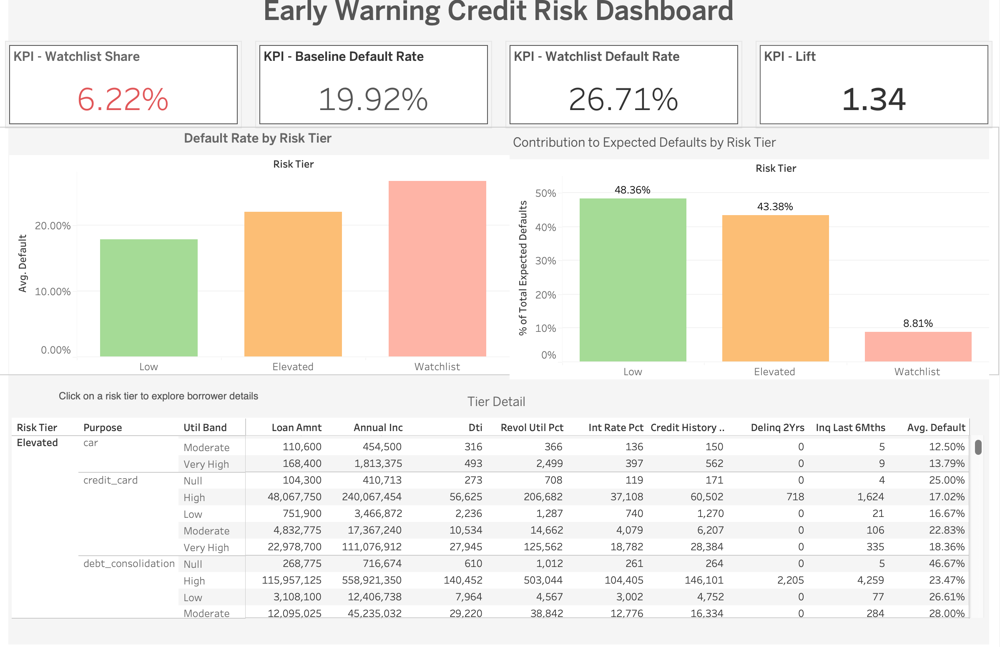
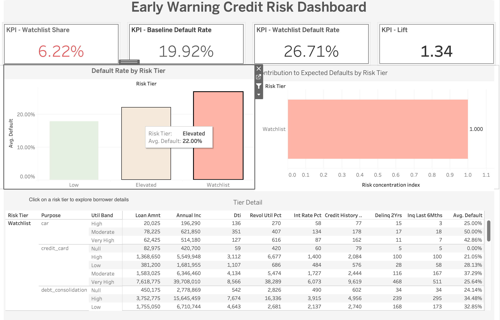
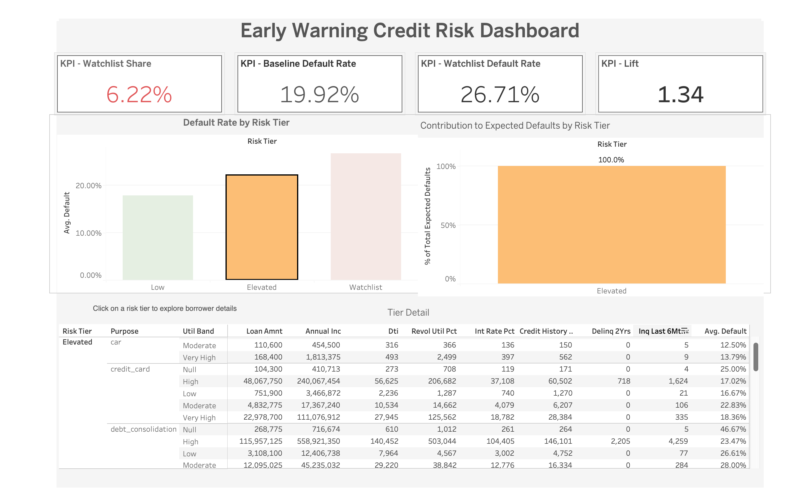

# Early Warning Credit Risk Dashboard

## Project Overview
This project analyzes borrower-level credit data to identify high-risk segments and enable early risk detection for financial institutions.

The goal is to move beyond simple reporting and answer:

*Which borrowers are most likely to default, and where should risk teams focus their attention?*

---

##  Problem Statement
Financial institutions often rely on overall default rates, which can hide critical risk concentrations.

A small segment of borrowers may:
- Represent a small portion of the portfolio
- But contribute disproportionately to defaults

This project identifies such segments and enables **targeted risk mitigation**.

---

## 📖 The "Needle in a Haystack" Story
If a bank manages a portfolio of 100,000 loans, it might see a safe average default rate of 19.9% and decide to "stay the course." 

**However, the average lies.** 

By building this early-warning system, I uncovered that **6% of the portfolio** accounts for over **26% of the risk**. This project isn't just about reporting history; it's about providing a "hit list" for risk managers to take preemptive action—like reducing credit limits or increasing monitoring—*before* the defaults actually happen, potentially saving millions in capital.

---

## 💡 Key Findings & Insights
- **Concentrated Risk**: The "Watchlist" segment is **34% riskier** than the portfolio average (Risk Index: 1.34).
- **Hidden Patterns**: Borrowers with high credit utilization (>80%) combined with even one recent delinquency are **4x more likely** to default than clean-profile borrowers.
- **Exposure Management**: While the "Low" risk tier has the most total money, the "Watchlist" has the highest **rate of loss**, meaning any dollar invested there is highly inefficient.

---

## Analytical Approach

1. Data preprocessing and feature engineering
2. Risk segmentation (Low, Elevated, Watchlist)
3. KPI computation:
   - Default rates
   - Watchlist share
   - Risk Concentration Index
4. Expected default contribution analysis

---

## Dashboard Features

### 1. KPI Summary
- Watchlist Share
- Baseline Default Rate
- Watchlist Default Rate
- Lift

### 2. Default Rate by Risk Tier
Visual comparison of default probability across segments

### 3. Risk Concentration Index
Identifies which segments are disproportionately contributing to total defaults.

Interpretation:
- **Index > 1.0**: Segment "over-contributes" to risk relative to its size.
- **Index < 1.0**: Segment is safer than the portfolio average.

The **Watchlist** tier shows a concentration index of **1.34**, meaning it is 34% riskier than the average borrower.

### 4. Interactive Exploration
- Click on a risk tier
- Table updates dynamically
- Enables drill-down into borrower segments

---

## Dashboard Preview

### Main Dashboard

### Interaction Example (Filtering)

---

## Tools used
- Python (Pandas, Scikit-learn, DuckDB)
- SQL (Analytical queries for EDA)
- Tableau Public
- Data Cleaning & Feature Engineering
- Risk Segmentation

---

## 🚀 Quick Start
1. **Clone the repo**: `git clone https://github.com/ishmeet2001/Credit-Risk-Analysis.git`
2. **Install dependencies**: `pip install -r requirements.txt`
3. **Run SQL EDA**: Open `notebooks/sql_eda.ipynb` to see the analytical queries.
4. **View Dashboard**: Open `dashboard/dashboard.twbx` in Tableau Public.

---

## Project Structure

Credit-Risk-Analysis/
│
├── README.md
├── data/
├── dashboard/
│   └── dashboard.twbx
├── images/
│   ├── dashboard.png
│   ├── interaction.png
│   └── contribution.png
├── notebooks/
│   ├── data_profiling.ipynb
│   └── sql_eda.ipynb
└── scripts/

---

## Future Improvements
Additionally, I worked on an improved version of this project available in my repo which adds real-time monitoring features.
